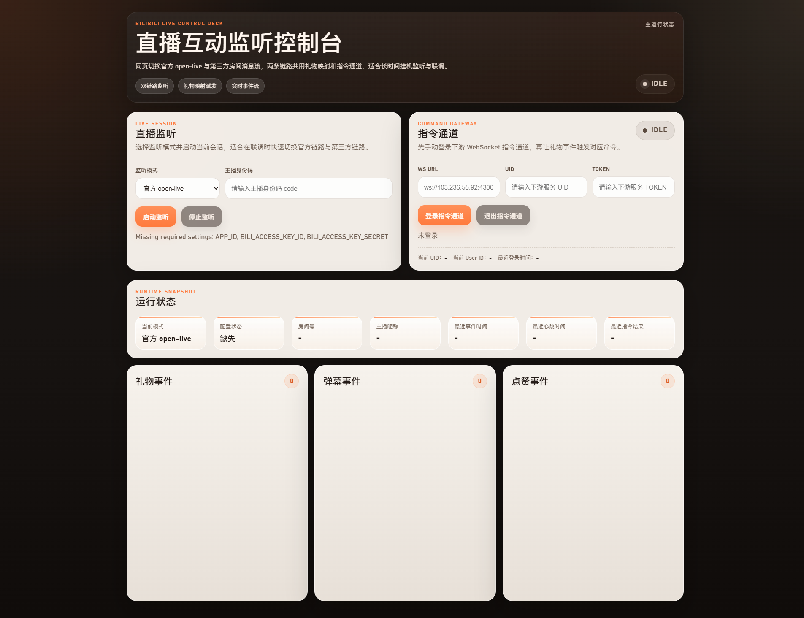

# Bililive-YOKONEX

一个基于 `Python + FastAPI` 的本地直播互动控制台，用来接入 Bilibili 直播事件，并把礼物事件映射成固定指令槽位 `command_one` 到 `command_ten` 发往下游 WebSocket 指令服务。

当前支持两种监听模式：

- 官方 `open-live`
- 第三方房间消息流 `LiveDanmaku`

两种模式共用同一套本地控制台、礼物映射规则和下游指令通道。

## 界面预览



## 功能概览

- 支持官方 `open-live` 链路，适合接入 B 站直播开放平台玩法
- 支持第三方房间消息流，适合快速监听普通直播间的礼物、弹幕、点赞
- 支持本地 Web 控制台，直接在浏览器中启动、停止、查看状态
- 支持手动登录下游 WebSocket 指令通道
- 支持礼物映射配置，按礼物单价区间命中固定指令槽位 `command_one` 到 `command_ten`
- 支持页面切换礼物触发模式：`单次触发` 或 `按礼物数量触发`
- 支持实时展示礼物、弹幕、点赞事件
- 支持打包为 Windows `exe`

## 项目结构

```text
app/
  api/                HTTP 接口
  bilibili/           官方 open-live 相关逻辑
  command_gateway/    下游指令通道封装
  services/           会话与业务服务
  static/             前端脚本与样式
  templates/          页面模板
  third_party/        第三方房间消息流适配
config/
  gift_command_mappings.json
docs/
  使用说明.md
  WEBSOCKET_API.md
tests/
run_app.py
build_exe.ps1
```

## 环境要求

- Python `3.11+`
- Windows 本地运行或打包环境
- 第三方模式下可访问普通 B 站直播间消息流
- 官方模式下额外需要：
  - `APP_ID`
  - `BILI_ACCESS_KEY_ID`
  - `BILI_ACCESS_KEY_SECRET`
  - 主播身份码 `code`

## 安装依赖

```bash
pip install -r requirements.txt
```

## 配置 `.env`

参考 [.env.example](.env.example) 创建 `.env`：

```env
APP_ID=1234567890123
BILI_ACCESS_KEY_ID=your_access_key_id
BILI_ACCESS_KEY_SECRET=your_access_key_secret
GIFT_MAPPING_PATH=config/gift_command_mappings.json
```

说明：

- `APP_ID` 为 B 站开放平台项目 ID
- 主播身份码 `code` 不放在 `.env`，在页面里手动输入
- 如果你只使用第三方模式，可以不填写开放平台字段
- 下游指令通道参数也不放 `.env`，由页面输入 `WS URL / UID / TOKEN`

## 配置礼物映射

参考 [config/gift_command_mappings.example.json](config/gift_command_mappings.example.json) 编辑 [config/gift_command_mappings.json](config/gift_command_mappings.json)。

示例：

```json
[
  {
    "min_price": 0,
    "max_price": 99,
    "command_slot": "command_one"
  },
  {
    "min_price": 100,
    "max_price": 999,
    "command_slot": "command_two"
  }
]
```

规则说明：

- 取礼物事件里的单个礼物价格，优先使用 `r_price`，没有时回退到 `price`
- 如果价格落在某个 `min_price ~ max_price` 区间内，就命中对应的 `command_slot`
- `max_price` 可以填 `null`，表示“不设上限”
- `command_slot` 只允许使用以下 10 个固定值：
  - `command_one`
  - `command_two`
  - `command_three`
  - `command_four`
  - `command_five`
  - `command_six`
  - `command_seven`
  - `command_eight`
  - `command_nine`
  - `command_ten`
- 页面支持两种触发模式：
  - `按礼物数量触发`：按 `gift_num` 连续触发多次
  - `单次触发`：每条礼物事件只触发一次
- 下游服务接收到的 `commandId` 就是命中的 `command_slot`

## 启动服务

```bash
uvicorn app.main:app --reload
```

启动后访问：

- [http://127.0.0.1:8000](http://127.0.0.1:8000)

## 使用流程

1. 打开页面，选择监听模式：
   - `官方 open-live`
   - `第三方房间消息流`
2. 选择礼物触发模式：
   - `按礼物数量触发`
   - `单次触发`
3. 在“指令通道”区域输入 `WS URL / UID / TOKEN`
4. 点击“登录指令通道”
5. 官方模式下输入主播身份码 `code`
6. 第三方模式下输入直播间房间长 ID `room_id`
7. 点击“启动监听”
8. 当收到礼物、弹幕、点赞事件时，页面会实时刷新
9. 当礼物价格命中映射区间时，程序会向下游发送 `sendCommand`

## 打包为 EXE

```powershell
.\build_exe.ps1
```

产物输出目录：

- `dist/BiliLive-YOKONEX/`

启动文件：

- `dist/BiliLive-YOKONEX/BiliLive-YOKONEX.exe`

## 自动发布 Release

仓库已经支持“推送版本标签后自动构建 Windows `exe` 并创建 GitHub Release”。

发布方式：

```bash
git tag v0.1.0
git push origin v0.1.0
```

触发后，GitHub Actions 会自动：

- 在 `windows-latest` 上安装依赖
- 运行关键测试
- 执行 `build_exe.ps1`
- 生成完整 zip 包
- 创建同名 Release
- 上传 `exe`、默认配置文件和 zip 包

## 测试

运行全量测试：

```bash
pytest -v
```

只跑前端相关回归：

```bash
pytest tests/test_frontend_assets.py -v
```

## 详细文档

- [使用说明](docs/使用说明.md)
- [下游 WebSocket API 文档](docs/WEBSOCKET_API.md)
- [Release 发布指南](docs/release-guide.md)

## 常见问题

### 官方模式提示配置缺失

请检查 `.env` 是否存在，并确认以下字段已填写：

- `APP_ID`
- `BILI_ACCESS_KEY_ID`
- `BILI_ACCESS_KEY_SECRET`

如果你只使用第三方模式，这个提示不会阻止第三方监听启动。

### `7007` 身份码错误

说明主播身份码 `code` 无效或已过期，请重新获取。

### `7003` 心跳过期

说明当前 `game_id` 已失效，需要重新启动监听。

### `7010` 超过连接上限

说明同一直播间下同一应用连接数超限，请先停止旧连接。
